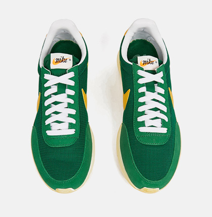
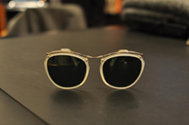

---
# You don't need to edit this file, it's empty on purpose.
# Edit theme's home layout instead if you wanna make some changes
# See: https://jekyllrb.com/docs/themes/#overriding-theme-defaults
layout: default
---

<!-- MAIN CONTENT SECTION -->
<section class="mainContent clearfix">
  

    

      

        

          <h4>Featured Collection</h4>
        

      

      

        

          

            
            
<a href="product-grid-left-sidebar.html" class="btn viewBtn">View Prodocts</a>

          

          

            <h4>Shoes</h4>
          

        

      

      

        

          

            
            
<a href="product-grid-left-sidebar.html" class="btn viewBtn">View Prodocts</a>

          

          

            <h4>Bags</h4>
          

        

      

      

        

          

            
            
<a href="product-grid-left-sidebar.html" class="btn viewBtn">View Prodocts</a>

          

          

            <h4>Glasses</h4>
          

        

      

    

    

      

        

          <h4>Featured Products</h4>
        

      

      

        

          

            

              
              

                <ul class="list-inline btn-group" role="group">
                  <li><a data-toggle="modal" href=".login-modal" class="btn btn-default"><i class="fa fa-heart"></i></a></li>
                  <li><a href="cart-page.html" class="btn btn-default"><i class="fa fa-shopping-cart"></i></a></li>
                  <li><a data-toggle="modal" href=".quick-view" class="btn btn-default"><i class="fa fa-eye"></i></a></li>
                </ul>
              

            

            

              <a href="single-product.html">
                <h5>Mauris efficitur</h5>
              </a>
              <h3>$199</h3>
            

          

          

            

              
              

                <ul class="list-inline btn-group" role="group">
                  <li><a data-toggle="modal" href=".login-modal" class="btn btn-default"><i class="fa fa-heart"></i></a></li>
                  <li><a href="cart-page.html" class="btn btn-default"><i class="fa fa-shopping-cart"></i></a></li>
                  <li><a data-toggle="modal" href=".quick-view" class="btn btn-default"><i class="fa fa-eye"></i></a></li>
                </ul>
              

            

            

              <a href="single-product.html">
                <h5>Nulla facilisi</h5>
              </a>
              <h3>$149</h3>
            

          

          

            

              
              

                <ul class="list-inline btn-group" role="group">
                  <li><a data-toggle="modal" href=".login-modal" class="btn btn-default"><i class="fa fa-heart"></i></a></li>
                  <li><a href="cart-page.html" class="btn btn-default"><i class="fa fa-shopping-cart"></i></a></li>
                  <li><a data-toggle="modal" href=".quick-view" class="btn btn-default"><i class="fa fa-eye"></i></a></li>
                </ul>
              

            

            

              <a href="single-product.html">
                <h5>Praesent dui felis</h5>
              </a>
              <h3>$79</h3>
            

          

          

            

              
              

                <ul class="list-inline btn-group" role="group">
                  <li><a data-toggle="modal" href=".login-modal" class="btn btn-default"><i class="fa fa-heart"></i></a></li>
                  <li><a href="cart-page.html" class="btn btn-default"><i class="fa fa-shopping-cart"></i></a></li>
                  <li><a data-toggle="modal" href=".quick-view" class="btn btn-default"><i class="fa fa-eye"></i></a></li>
                </ul>
              

            

            

              <a href="single-product.html">
                <h5>Cras eu faucibus</h5>
              </a>
              <h3>$109</h3>
            

          

          

            

              
              

                <ul class="list-inline btn-group" role="group">
                  <li><a data-toggle="modal" href=".login-modal" class="btn btn-default"><i class="fa fa-heart"></i></a></li>
                  <li><a href="cart-page.html" class="btn btn-default"><i class="fa fa-shopping-cart"></i></a></li>
                  <li><a data-toggle="modal" href=".quick-view" class="btn btn-default"><i class="fa fa-eye"></i></a></li>
                </ul>
              

            

            

              <a href="single-product.html">
                <h5>Mauris lobortis augue</h5>
              </a>
              <h3>$199</h3>
            

          

          

            

              
              

                <ul class="list-inline btn-group" role="group">
                  <li><a data-toggle="modal" href=".login-modal" class="btn btn-default"><i class="fa fa-heart"></i></a></li>
                  <li><a href="cart-page.html" class="btn btn-default"><i class="fa fa-shopping-cart"></i></a></li>
                  <li><a data-toggle="modal" href=".quick-view" class="btn btn-default"><i class="fa fa-eye"></i></a></li>
                </ul>
              

            

            

              <a href="single-product.html">
                <h5>Suspendisse suscipit</h5>
              </a>
             <h3>$149</h3>
            

          

          

            

              
              

                <ul class="list-inline btn-group" role="group">
                  <li><a data-toggle="modal" href=".login-modal" class="btn btn-default"><i class="fa fa-heart"></i></a></li>
                  <li><a href="cart-page.html" class="btn btn-default"><i class="fa fa-shopping-cart"></i></a></li>
                  <li><a data-toggle="modal" href=".quick-view" class="btn btn-default"><i class="fa fa-eye"></i></a></li>
                </ul>
              

            

            

              <a href="single-product.html">
                <h5>Praesent a augue</h5>
              </a>
              <h3>$79</h3>
            

          

          

            

              
              

                <ul class="list-inline btn-group" role="group">
                  <li><a data-toggle="modal" href=".login-modal" class="btn btn-default"><i class="fa fa-heart"></i></a></li>
                  <li><a href="cart-page.html" class="btn btn-default"><i class="fa fa-shopping-cart"></i></a></li>
                  <li><a data-toggle="modal" href=".quick-view" class="btn btn-default"><i class="fa fa-eye"></i></a></li>
                </ul>
              

            

            

              <a href="single-product.html">
                <h5>Cras vel augue</h5>
              </a>
              <h3>$109</h3>
            

          

        

      

    

    

      

        

          <h4>Latest Articles</h4>
        

      

      

        

          <h5><a href="blog-single-right-sidebar.html">Donec egestas tortor quis mattis</a></h5>
          July 16, 2016 by <a href="#">Abdus</a>
          
          

            
Nulla facilisi. Mauris efficitur, massa et iaculis accumsan, mauris velit ultrices purus, quis condimentum nibh dolor ut tortor.

          

        

      

      

        

          <h5><a href="blog-single-right-sidebar.html">Pellentesque risus quis tellus</a></h5>
          July 16, 2016 by <a href="#">Abdus</a>
          
          

            
Praesent dui felis, gravida a auctor at, facilisis commodo ipsum. Cras eu faucibus justo. Nullam varius cursus nisi.

          

        

      

      

        

          <h5><a href="blog-single-right-sidebar.html">Mauris lobortis augue ex</a></h5>
          July 16, 2016 by <a href="#">Abdus</a>
          
          

            
Etiam aliquam turpis quis blandit finibus. Lorem ipsum dolor sit amet, consectetur adipiscing elit.

          

        

      

      

        

          <h5><a href="blog-single-right-sidebar.html">Suspendisse vestibulum dignissim</a></h5>
          July 16, 2016 by <a href="#">Abdus</a>
          
          

            
Suspendisse tristique interdum est, at hendrerit nunc laoreet et. Nulla vel arcu ac turpis pulvinar tincidunt eu eu nisi.

          

        

      

    

  

</section>

<!-- LIGHT SECTION -->
<section class="lightSection clearfix">
  

    

      

        

          

            

              
            

          

          

            

              
            

          

          

            

              
            

          

          

            

              
            

          

          

            

              
            

          

          

            

              
            

          

          

            

              
            

          

          

            

              
            

          

        

      

    

  

</section>
